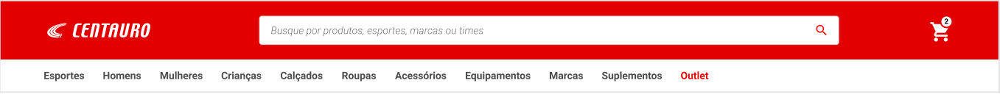
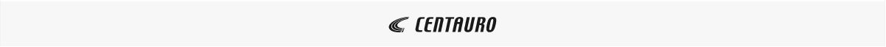
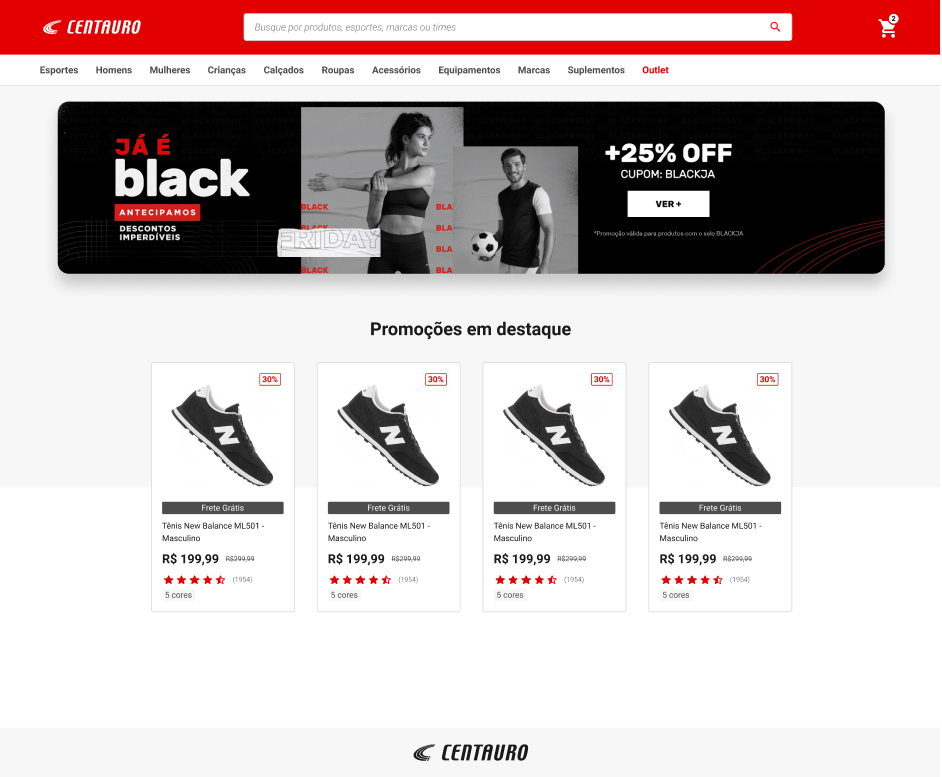
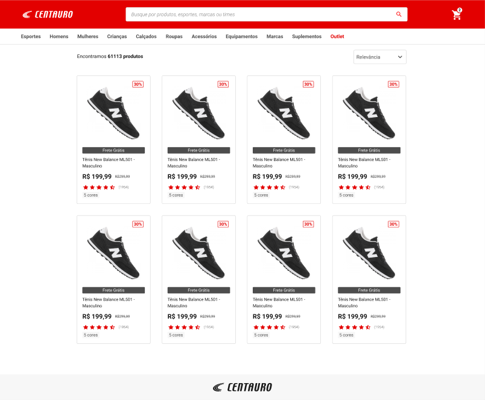
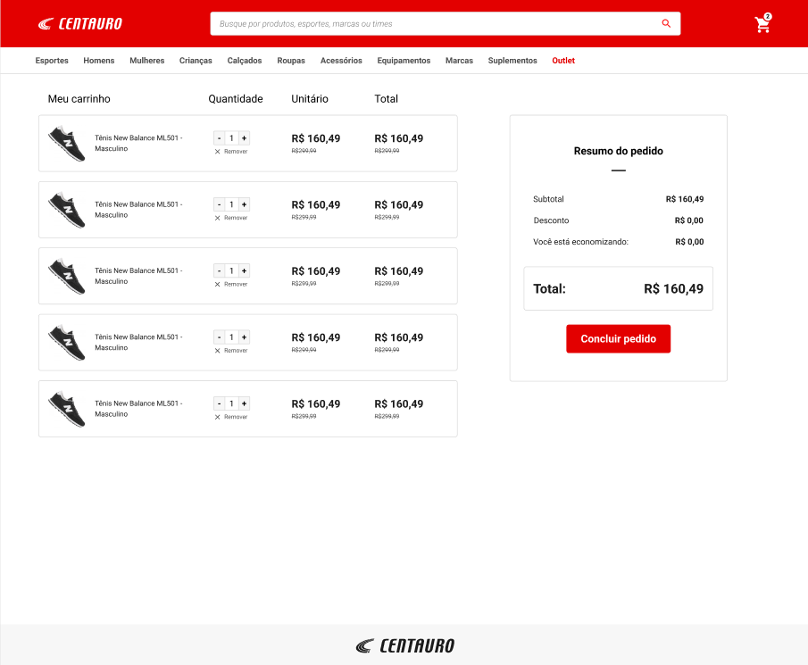
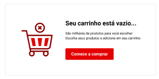
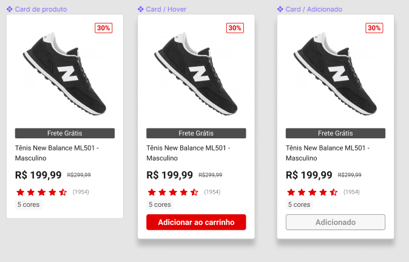
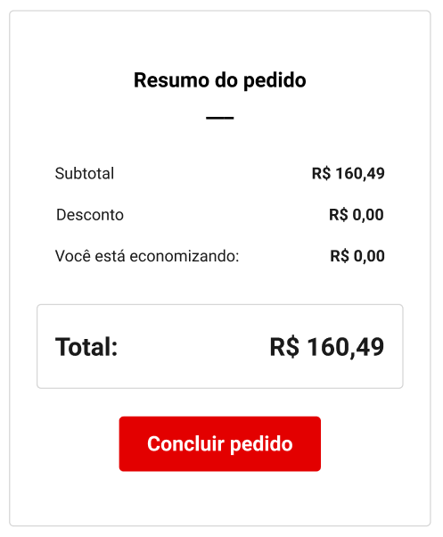

# Grupo SBF e Laboratoria

_#jogamosentrosados_

 

Nós do Grupo SBF estamos entusiasmados em fazer parte dessa tilha junto à Laboratoria.

Este desafio foi pensado com muito carinho e já fez parte do nosso processo de contratação das pessoas candidatas do Grupo, achamos que seria uma boa experiência para conhecimento de um de nossos fluxos em ecommerces.

Esperamos que aproveitem e se divirtam com o processo de construção 💛

# Mini e-commerce

A Centauro agora faz parte do Grupo SBF e estamos reformulando a experiência
de navegação dos usuários em nosso site. Foi identificado alguns pontos de
melhorias nas páginas home, busca e carrinho.

O objetivo desse desafio é implementar o novo layout proposto pelo time de Design.

## Material de apoio

- [Link do layout](https://www.figma.com/file/vrnqryiFNY6p62lJnBq8KR/Desafio-T%C3%A9cnico)
- [Servidor](./backend/README.md) - Em alguns pontos da aplicação será necessário
buscar informações em um servidor. No arquivo `backend/README.md` há detalhes
sobre os endpoints e instruções sobre como você irá inicializar o servidor.

## Hand-off

Durante o processo de hand-off a equipe de design passou os seguintes requisitos:

### Header

- O Header será o mesmo em todas as páginas;

- O Header deverá permanecer fixo no topo da página independente do scroll do usuário;

- Quando o usuário buscar por um produto, ele deverá ser redirecionado para a
página de busca sendo exibido os produtos que coresponderem com o termo solicitado.

- Quando o usuário adicionar/remover itens no carrinho o número de itens deverá ser
  atualizado no ícone que existe no Header.

- Ao clicar no ícone do carrinho o usuário deverá ser direcionado para a página
do carrinho.

- Os links do menu serão estáticos e não devem redirecionar o usuário. Isso foi
um pedido do time de Design porque ainda estão construindo as outras páginas do projeto.

### Footer

- O Footer será o mesmo em todas as páginas;

- O Footer deverá ser exibido ao final do conteúdo da página
~~(não é fixo igual o header)~~;

### Página Home

- O banner será estático e sempre exibirá a mesma imagem;

- Você deverá consumir a API de promoções para exibir as promoções em destaque;

### Página de Busca

- Você deverá consumir a API de busca para exibir os itens nessa página;

- A ordenação dos itens poderá ser alterada pelo usuário. As ordens possíveis são:

  - Relevância
  - Menor preço
  - Maior preço
  - Maior desconto

- O contador de itens deverá ser atualizado com o número de itens
encontrados na busca

### Página do carrinho

- Os itens deverão continuar no carrinho mesmo que o usuário atualize a página;

- O usuário deve conseguir adicionar/remover itens do carrinho;

- Se não existirem itens no carrinho, deverá ser exibido a mensagem abaixo:

## Atenção a esses pontos

### Card de produto

- O selo de frete grátis deve ser exibido apenas para os produtos que possuem
  frete grátis;

- A porcentagem de desconto e o valor antigo só devem ser exibidos caso o produto
  possua desconto;

- Ao passar o mouse em cima do card, o botão de Adicionar ao carrinho deverá
  ser exibido;

- Ao clicar em adicionar ao carrinho, o botão mudará de aparência e o produto
deverá ser adicionado ao carrinho.

### Resumo do pedido

- O valor total da compra deverá ser atualizado sempre que o usuário adicionar/remover
  itens;

- Alguns itens do carrinho podem ter desconto e o valor total do desconto deve ser
  computado;

- Quando o usuário clicar em concluir pedido o carrinho deverá ser limpo e uma mensagem
  de alerta deverá ser exibida para o usuário com a seguinte mensagem:
  "Parabéns, compra concluída";
